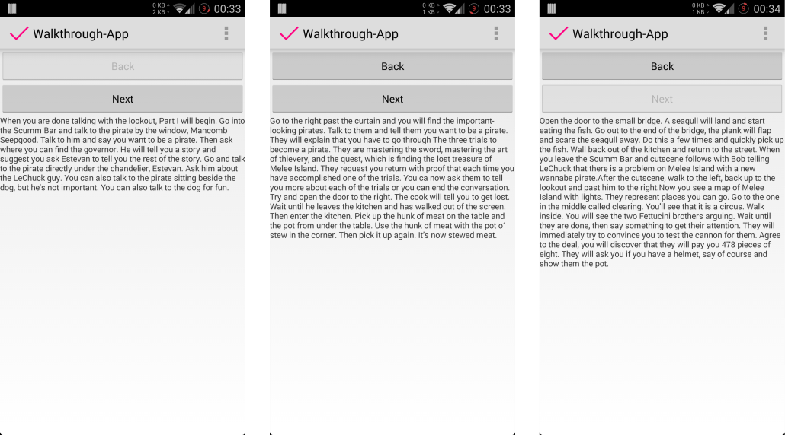
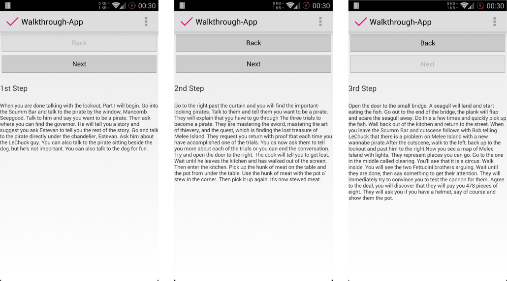

# 02 | Walkthrough

## Downloads

- [Download des Starterpakets](https://github.com/Android-Regensburg/U02-Walkthrough/archive/master.zip)
- [Download des Lösungsvorschlag](https://github.com/Android-Regensburg/U02-Walkthrough/archive/solution.zip)

## Aufgabe

Erstellen Sie eine einfache App, um das Konzept der Activities und Intents zu üben und den Zusammenhang zwischen Activities und Layouts zu vertiefen.
Ihre App soll aus drei Acitvities bestehen, die jeweils einen Teil des *Monkey Island*-Walkthroughs (Texte am Schluss des Dokuments) anzeigen. Mit den Buttons Vor und Zurück soll zwischen den Teilen gewechselt werden können.

## Hinweise

* Um die Gestaltung des Layouts einfacher zu machen, nutzen sie ein `LinearLayout`.
* Beachten Sie, dass für das `LinearLayout` zusätzliche Attribute vergeben werden müssen. Beispielsweise das Attribut `orientation`, mit dem die Richtung angepasst werden kann, in der die UI-Elemente angeordnet werden.
* Geben sie den UI-Elementen in ihrem Layout eine ID, damit  Sie sie in den Activities referenzieren können.

## Vorgehen
1. Erstellen sie ein neues Android Studio Projekt mit einer `Empty Acitivity`.
2. Tragen Sie in der `strings.xml` drei neue Strings ein für die Texte, die später in den Activities angezeigt werden sollen. Geben Sie den Strings geeignete Namen. Im Anhang dieses Dokuments finden Sie die Texte für Ihre App.
3. Fügen Sie nun noch zwei weitere Strings ein, die dazu dienen werden, die Buttons zu beschriften.
4. Verändern Sie das vorgegebene Layout in der `activity_main.xml`. Überlegen Sie sich, welche UI-Elemente Sie benötigen und fügen Sie diese dem Layout hinzu. Wie die Elemente angeordnet werden sollen, entnehmen Sie den Screenshots im Anhang (Abbildung 1).
5. Wechseln Sie nun in die Activity, um sie wie folgt anzupassen:
   1. Erstellen Sie Variablen für die verwendeten Layout-Elemente. Diese sollen dem kleinstmöglichen Sichtbarkeitsbereich unterliegen.
   2. Greifen Sie in der `onCreate()`-Methode auf das UI-Element `TextView` zu. 
   3. Holen Sie sich nun den Text für das `TextView` aus der `strings.xml` und fügen Sie ihn dem `TextView` hinzu.
   4. Probieren Sie, von Zeit zu Zeit, ihre App laufen zu lassen. So können Sie leicht überprüfen, ob alles so funktioniert, wie Sie es möchten.
   5. Den Text für die Buttons, können Sie nach dem zuvor erklärten Prinzip ebenfalls zuweisen.
   6. Da Sie momentan die erste Activity erstellen, sollte der *Zurück* Button noch deaktiviert (ausgegraut) sein. Dazu können Sie die Methode `setEnabled(boolean)` des Buttonobjekts verwenden.
   7. Die Buttons werden jetzt zwar angezeigt, haben jedoch keine Funktion. Um ihnen eine Funktion zu geben, verwenden Sie die Methode `setOnClickListener()`,  dem Sie ein `OnClickListener`-Objekt als Parameter übergeben. Dieses `OnClickListener`-Objekt erzeugen Sie direkt an der Stelle des Parameters. Bei der Erzeugung eines Objekts der Klasse `OnClickListener`, muss die abstrakte Methode `onClick(View v)`  überschrieben werden. Um eine Activity zu beenden, rufen sie die Methode `finish()` der Activity auf und sie wird geschlossen.
6. Die anderen beiden Activities legen Sie durch Kopieren der Ersten an. Tragen sie diese auch in der `AndroidManifest.xml` ein. Denken Sie daran, die Texte anzupassen und die Buttons zu de-/aktivieren, sowie ggf. einen weiteren `OnClickListener` zu setzen.
7. In den jeweiligen `onClick()`-Methoden sollen Intents dazu benutzt werden, um die nächste Activity zu starten, bzw. die aktuelle zu beenden.

**Optional** Überlegen Sie sich, wie Sie die Code-Usability erhöhen können, indem sie geeignete Methoden erstellen.

**Optional** Um Ihre App ein wenig ansprechender zu gestalten, können Sie auch noch einen Titel für jede Seite über den Text setzen (Sie benötigen hierfür ein weiteres `TextView`). Wie das aussehen könnte sehen Sie in den Screenshots im Anhang.

Probieren Sie zudem ein wenig mit den XML-Attributen herum, die sie im Layout etwa dem `TextView` vergeben können, um es etwas schöner darzustellen, wie es in den angehängten Screenshots (Abbildung 2) zu sehen ist.

## Walkthrough-Texte
### Seite 1  
When you are done talking with the lookout, Part I will begin. Go into the Scumm Bar and talk to the pirate by the window, Mancomb  Seepgood. Talk to him and say you want to be a pirate. Then ask where you can find the governor. He will tell you a story and suggest you ask Estevan to tell you the rest of the story. Go and talk to the pirate directly under the chandelier, Estevan. Ask him about the LeChuck guy. You can also talk to the pirate sitting beside the dog, but he’s not important. You can also talk to the dog for fun.

### Seite 2
Go to the right past the curtain and you will find the important-looking pirates. Talk to them and tell them you want to be a pirate. They will explain that you have to go through “The three trials” to become a pirate. They are mastering the sword, mastering the art of thievery, and the quest, which is finding the lost treasure of Melee Island. They request you return with proof that each time you have accomplished one of the trials. You can now ask them to tell you more about each of the trials or you can end the conversation. Try and open the door to the right. The cook will tell you to get lost. Wait until he leaves the kitchen and has walked out of the screen. Then enter the kitchen. Pick up the hunk of meat on the table and the pot from under the table. Use the hunk of meat with the pot o´ stew in the corner. Then pick it up again. It’s now stewed meat

### Seite 3
Open the door to the small bridge. A seagull will land and start eating the fish. Go out to the end of the bridge, the plank will flap and scare the seagull away. Do this a few times and quickly pick up the fish. Wall back out of the kitchen and return to the street. When you leave the Scumm Bar and cutscene follows with Bob telling LeChuck that there is a problem on Melee Island with a new wannabe pirate. After the cutscene, walk to the left, back up to the lookout and past him to the right. Now you see a map of Melee Island with lights. They represent places you can go. Go to the one in the middle called “clearing”. You’ll see that it is a circus. Walk inside. You will see the two Fettucini brothers arguing. Wait until they are done, then say something to get their attention. They will immediately try to convince you to test the cannon for them. Agree to the deal, you will discover that they will pay you 478 pieces of eight. They will ask you if you have a helmet, say of course and show them the pot.

## Quellen
Große Teile dieser Anleitung wurden aus der Übungsaufgabe 2 des Sommersemesters 2013 von Thomas Wagner (Universität Regensburg) übernommen.  
Der Walkthrough-Text kommt von: http://www.worldofmi.com/gamehelp/walk/monkey1.php

## Anhang
### Screenshots
  

